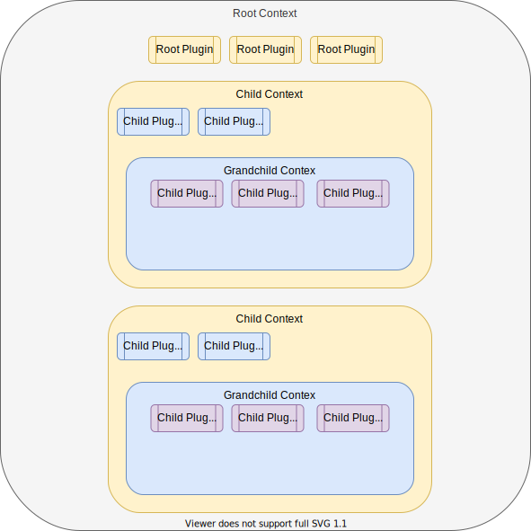

<h1 align="center">Fastify</h1>

## Encapsulation
<a id="encapsulation"></a>

A fundamental feature of Fastify is the "encapsulation context." It governs
which [decorators](./Decorators.md), registered [hooks](./Hooks.md), and
[plugins](./Plugins.md) are available to [routes](./Routes.md). A visual
representation of the encapsulation context is shown in the following figure:



In the figure above, there are several entities:

1. The _root context_
2. Three _root plugins_
3. Two _child contexts_, each with:
    * Two _child plugins_
    * One _grandchild context_, each with:
        - Three _child plugins_

Every _child context_ and _grandchild context_ has access to the _root plugins_.
Within each _child context_, the _grandchild contexts_ have access to the
_child plugins_ registered within the containing _child context_, but the
containing _child context_ **does not** have access to the _child plugins_
registered within its _grandchild context_.

Given that everything in Fastify is a [plugin](./Plugins.md) except for the
_root context_, every "context" and "plugin" in this example is a plugin
that can consist of decorators, hooks, plugins, and routes. As plugins, they
must still signal completion either by returning a Promise (e.g., using `async` functions)
or by calling the `done` function if using the callback style.

To put this
example into concrete terms, consider a basic scenario of a REST API server
with three routes: the first route (`/one`) requires authentication, the
second route (`/two`) does not, and the third route (`/three`) has access to
the same context as the second route. Using [@fastify/bearer-auth][bearer] to
provide authentication, the code for this example is as follows:

```js
'use strict'

const fastify = require('fastify')()

fastify.decorateRequest('answer', 42)

fastify.register(async function authenticatedContext (childServer) {
  childServer.register(require('@fastify/bearer-auth'), { keys: ['abc123'] })

  childServer.route({
    path: '/one',
    method: 'GET',
    handler (request, response) {
      response.send({
        answer: request.answer,
        // request.foo will be undefined as it is only defined in publicContext
        foo: request.foo,
        // request.bar will be undefined as it is only defined in grandchildContext
        bar: request.bar
      })
    }
  })
})

fastify.register(async function publicContext (childServer) {
  childServer.decorateRequest('foo', 'foo')

  childServer.route({
    path: '/two',
    method: 'GET',
    handler (request, response) {
      response.send({
        answer: request.answer,
        foo: request.foo,
        // request.bar will be undefined as it is only defined in grandchildContext
        bar: request.bar
      })
    }
  })

  childServer.register(async function grandchildContext (grandchildServer) {
    grandchildServer.decorateRequest('bar', 'bar')

    grandchildServer.route({
      path: '/three',
      method: 'GET',
      handler (request, response) {
        response.send({
          answer: request.answer,
          foo: request.foo,
          bar: request.bar
        })
      }
    })
  })
})

fastify.listen({ port: 8000 })
```

The server example above demonstrates the encapsulation concepts from the
original diagram:

1. Each _child context_ (`authenticatedContext`, `publicContext`, and
   `grandchildContext`) has access to the `answer` request decorator defined in
   the _root context_.
2. Only the `authenticatedContext` has access to the `@fastify/bearer-auth`
   plugin.
3. Both the `publicContext` and `grandchildContext` have access to the `foo`
   request decorator.
4. Only the `grandchildContext` has access to the `bar` request decorator.

To see this, start the server and issue requests:

```sh
# curl -H 'authorization: Bearer abc123' http://127.0.0.1:8000/one
{"answer":42}
# curl http://127.0.0.1:8000/two
{"answer":42,"foo":"foo"}
# curl http://127.0.0.1:8000/three
{"answer":42,"foo":"foo","bar":"bar"}
```

[bearer]: https://github.com/fastify/fastify-bearer-auth

## Sharing Between Contexts
<a id="shared-context"></a>

Each context in the prior example inherits _only_ from its parent contexts. Parent
contexts cannot access entities within their descendant contexts. If needed,
encapsulation can be broken using [fastify-plugin][fastify-plugin], making
anything registered in a descendant context available to the parent context.

To allow `publicContext` access to the `bar` decorator in `grandchildContext`,
rewrite the code as follows:

```js
'use strict'

const fastify = require('fastify')()
const fastifyPlugin = require('fastify-plugin')

fastify.decorateRequest('answer', 42)

// `authenticatedContext` omitted for clarity

fastify.register(async function publicContext (childServer) {
  childServer.decorateRequest('foo', 'foo')

  childServer.route({
    path: '/two',
    method: 'GET',
    handler (request, response) {
      response.send({
        answer: request.answer,
        foo: request.foo,
        bar: request.bar
      })
    }
  })

  childServer.register(fastifyPlugin(grandchildContext))

  async function grandchildContext (grandchildServer) {
    grandchildServer.decorateRequest('bar', 'bar')

    grandchildServer.route({
      path: '/three',
      method: 'GET',
      handler (request, response) {
        response.send({
          answer: request.answer,
          foo: request.foo,
          bar: request.bar
        })
      }
    })
  }
})

fastify.listen({ port: 8000 })
```

Restarting the server and re-issuing the requests for `/two` and `/three`:

```sh
# curl http://127.0.0.1:8000/two
{"answer":42,"foo":"foo","bar":"bar"}
# curl http://127.0.0.1:8000/three
{"answer":42,"foo":"foo","bar":"bar"}
```

[fastify-plugin]: https://github.com/fastify/fastify-plugin
